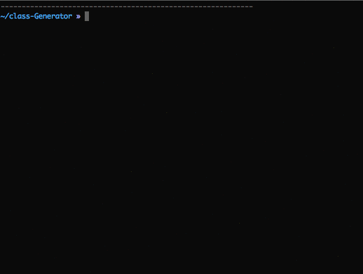

# Database-to-class
Generate PHP Class files according to your Database structure with modern PHP 8.1+ syntax

## Requirements

- PHP 8.1 or higher
- MySQL/MariaDB database
- PDO extension

## Installation

### Via Composer (Recommended)

```sh
composer require ngfw/database-to-class
```

### Manual Installation

1. Clone or download this repository
2. Run `composer install` to generate autoloader
3. Include the autoloader: `require 'vendor/autoload.php';`

## Getting Started

1. Edit `dbconfig.php` to configure your database connection
2. Make sure `GeneratedClasses` directory is writable
```sh
chmod 777 GeneratedClasses
```

## Usage

### With Composer Autoloading (Recommended)

```php
<?php
require 'vendor/autoload.php';

use DatabaseToClass\ClassGenerator;

$generator = new ClassGenerator();
$generator->setTable('users');
$classCode = $generator->buildClass();
file_put_contents('GeneratedClasses/users.php', $classCode);
```

### Legacy Method (Backward Compatible)

The `Classes/` directory still works for backward compatibility:

```php
<?php
include('Classes/ClassGenerator.php');

$generator = new ClassGenerator();
// ... rest of your code
```

## Generate classes via CLI

The new CLI uses Symfony Console for a modern experience with colors, progress bars, and interactive prompts.

### Commands

**Interactive mode** (select table from list):
```sh
php generate.php
```

**List all tables**:
```sh
php generate.php list-tables
```

**Generate specific table**:
```sh
php generate.php generate users
```

**Generate all tables**:
```sh
php generate.php generate --all
```

**Custom output directory**:
```sh
php generate.php generate users --output=app/Models
```

### Features
- 🎨 Colored output for better readability
- 📊 Progress bars for bulk generation
- 🔍 Interactive table selection
- ✅ Validation of table primary keys
- 📋 Relationship detection display



## Generate classes via web interface
if you webserver is not already pointing to Directory where files are located, you can simply run:
```sh
\>$ php -S localhost:8080
```

then open you browser and navigate to `http://localhost:8080`

**Web interface will also generate class usage documentation**

## Features

### Modern CLI with Symfony Console
Professional command-line interface with rich features:
- **Colored output**: Easy-to-read success/error messages
- **Interactive prompts**: Select tables from a list
- **Progress bars**: Visual feedback for bulk operations
- **Table listing**: View all tables with status indicators
- **Flexible options**: Generate single table, all tables, or custom output directory
- **Helpful commands**: Built-in help and command descriptions

### Modern PHP 8.1+ Syntax
Generated classes use cutting-edge PHP features:
- Typed properties for better IDE support and type safety
- Union types (e.g., `int|string`, `bool|int`)
- Strict types declaration for compile-time type checking
- Modern array syntax and null coalescing operators
- Return type declarations on all methods

### Automatic Validation
Generated classes include built-in validation based on your database schema:
- **Type validation**: Ensures integers are integers, numbers are numeric, etc.
- **Length validation**: Enforces VARCHAR and CHAR length constraints
- **Required field validation**: Checks NOT NULL columns
- **ENUM validation**: Validates against allowed enum values
- **Easy error handling**: Get detailed validation errors

```php
$user = include("GeneratedClasses/users.php");
$user->email = "invalid-email-that-is-way-too-long-for-the-database-column";
$user->age = "not a number";

if (!$user->validate()) {
    print_r($user->getValidationErrors());
    // Array
    // (
    //     [email] => Array([0] => email exceeds maximum length of 255)
    //     [age] => Array([0] => age must be an integer)
    // )
} else {
    $user->add();
}
```

### Automatic Relationship Detection
The generator automatically detects foreign key relationships and generates methods for easy data access:

- **BelongsTo Relationships**: When your table has a foreign key to another table
- **HasMany Relationships**: When other tables have foreign keys pointing to your table

#### Example Usage

If you have a `posts` table with a `user_id` foreign key to `users` table:

```php
// BelongsTo: Get the user who created a post
$post = include("GeneratedClasses/posts.php");
$postData = $post->get_id(1);
foreach($postData[0] as $key => $value) {
    $post->{$key} = $value;
}
$author = $post->user(); // Returns the related user record

// HasMany: Get all posts by a user
$user = include("GeneratedClasses/users.php");
$userData = $user->get_id(1);
foreach($userData[0] as $key => $value) {
    $user->{$key} = $value;
}
$posts = $user->posts(10); // Returns up to 10 posts by this user
```

The generated documentation will show all detected relationships and how to use them.

----------
Have fun
